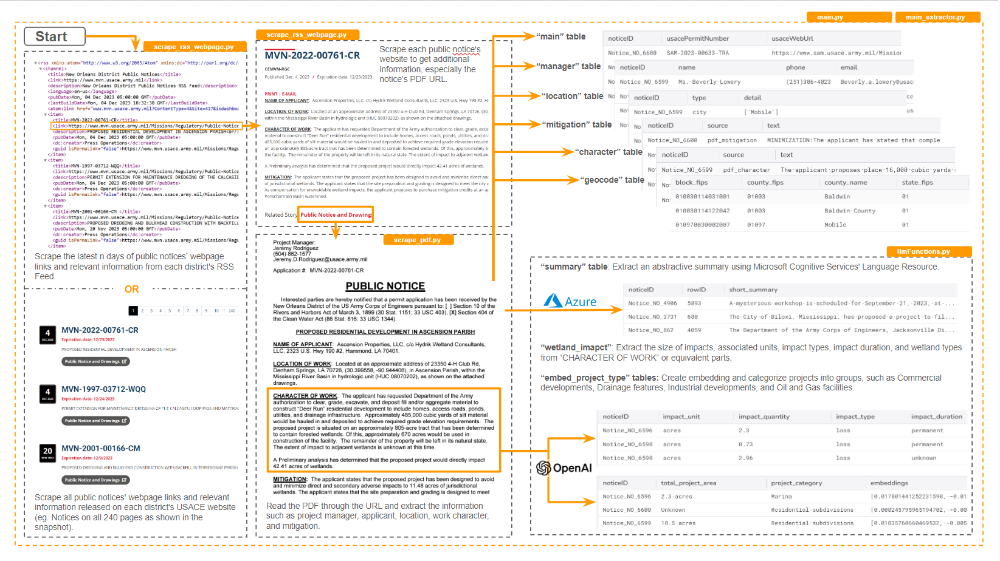

## Wetlands Tracker
### Overview
The U.S. Army Corps of Engineers (USACE) evaluates permit applications for any work, including construction and dredging, in the Nation’s navigable waters. The Wetlands Impact Tracker compiles public notices of those permit applications from USACE, typically stored in PDFs. The data pulled from these notices can help users better understand the impact of development projects on sensitive areas by revealing and summarizing individual notices, and aggregating data. We encourage you to use this tool to explore and better understand how development projects are impacting the communities you work with and live in.

### Prerequisite and Installation
* Install Python: If you don't have Python installed, download and install it from the official [Python website](https://www.python.org/downloads/).
* Clone or Download the Repository:
   * If Git is installed, clone the repository using the following command in Git Bash on Windows or terminal in other systems:
      ```
      cd the-path-you-would-like-to-hold-the-repository
      git clone https://github.com/AtlasPublicPolicy/wetlands-tracker.git
      ```
   * If you don't have Git installed, you can download the repository as a ZIP file from the GitHub page. Click on the "Code" button and select "Download ZIP." After downloading, extract the ZIP file to the directory of your choice.
* Set Up and Activate a Virtual Environment in PowerShell or Command Prompt on Windows or in terminal in Other Systems:
   * Create a new virtual environment:
      ```
      # Navigate to the project directory:
      cd the-path-you-hold-the-repository

      # Create a virtual environment:
      virtualenv venv

      # or
      python -m venv venv
      ```
   * Activate the virtual environment:<br>
     __Windows:__
     ```
     .\venv\Scripts\activate
     ```
     __macOS and Linux__
     ```
     source venv/bin/activate
     ```

### Usage
__In an active virtual environment__
1. Set up the configuration in __main.py__:
   * Create a file named "api_key.env" and provide the following keys:
     * AZURE_API_KEY=your_azure_api_key
     * AZURE_ENDPOINT=https://your-azure-endpoint.com
     * AWS_ACCESS_KEY_ID=your_aws_access_key_id
     * AWS_SECRET_ACCESS_KEY=your_aws_secret_access_key
     * OPENAI_API_KEY=your_openai_api_key
     * REDIVIS_API_KEY=your_redivis_api_key

   * Modify the following parameters as needed:
     * __update:__ Do you want to scrape all historical notices or only recently updated ones. 1, update; 0, first-time-scraping; default as 1. __Note: Be cautious when setting the update parameter to 1 (scrape all historical notices), as it might run for an extended period and incur high costs for Azure and LLM services.__
        
     * __n_days:__ How many days in the past would you like to search for updated notices: numeric # from 0 to 500; default as 14.
     
     * __max_notices:__ How many maximum notices (sorted by date) to download?
        
     * __district:__ which district you would like to scrape: "New Orleans", "Galveston", "Jacksonville", "Mobile", or "all"; default as "all".

     * __tbl_to_upload:__ which table you would like to upload to Redivis? Any of tables in the list = ["main", "manager", "character", "mitigation", "location", "fulltext", "summary", "wetland", "embed", "validation", "aws", "geocoded"], "none" or "all"; defaul as "all".
        
     * __price_cap:__ For Azure summarization, please set a price cap; defaul as 5 ($).
        
     * __n_sentences:__ How many sentences you would like to have for summarization; defaul as 4.
        
     * __directory:__ file directory; default as "data_schema/".

     * __overwrite_redivis:__ Overwrite file with same name on Redivis; 1, yes; 0, no; default as no.

     * __skipPaid:__ Skip paid services including OpenAI and Azure Summaries. 1, skip; 0, do not skip; default = 0

     * __tesseract_path:__ If you have problem running OCR(Optical Character Recognition), please specify the path for tesseract.exe such as "C:/Program Files/Tesseract-OCR/tesseract.exe"; default as None.
        
     * __GPT_MODEL_SET:__ Set GPT model; default as "gpt-3.5-turbo-0613"

2. Run main.py in the virtual environment:
   ```
   (venv) $ python main.py
   ```

### File Descriptions
* requirements.txt: Lists all Python dependencies required for running the project.
* Other scripts:


### Troubleshooting
* __log.txt__: You can find messages, warnings, and errors here.
* __error_report.md__: This file captures the potential problems with the PDF reading process, special notices, Regex patterns, and LLM performance, which will not break the running and will not be reported in log.txt.

### Contributing
Guidelines for contributing to the project, including how to submit pull requests, report issues, or add features.

### License
Information about the project's license.

### Contact
Details for reaching out to the project maintainers or contributors.
