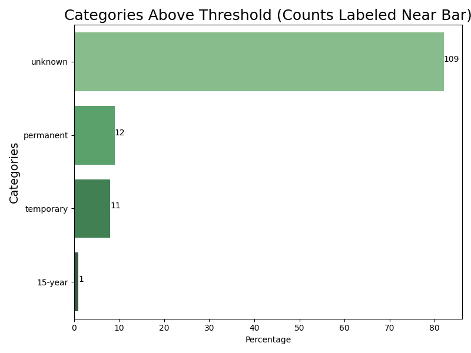
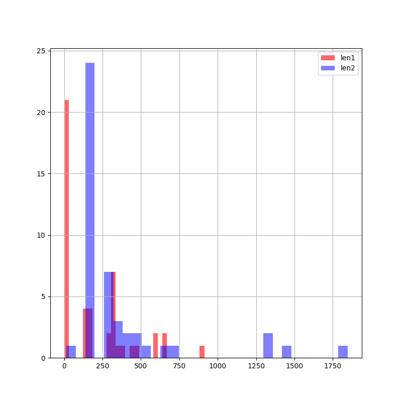

# 1: Check the results pulled by regex

## 1.1 Track PDF reading problems

| PDF Reading Status                                           |   Count |   Percentage (%) |
|:-------------------------------------------------------------|--------:|-----------------:|
| normal                                                       |      46 |               92 |
| No text in PDF (only attachment); replaced with webpage text |       4 |                8 |

50 (100.0%) of notices have valid texts

## 1.2 For those notices that have a valid texts, how many are special public notices?

|   Special Notice |   Count |   Percentage (%) |
|-----------------:|--------:|-----------------:|
|                0 |      48 |               96 |
|                1 |       2 |                4 |

48 (96.0%) notices having texts from PDF or webpage are not special public notices.

## 1.3 Non-special notices that have unknown or NA values

| Column                  |   Unknown Count |   Unknown Percentage (%) |
|:------------------------|----------------:|-------------------------:|
| pdf_cup                 |              48 |                   100    |
| pdf_wqc                 |              47 |                    97.92 |
| pdf_parish              |              30 |                    62.5  |
| hydrologicUnitCode      |              30 |                    62.5  |
| web_applicant           |              24 |                    50    |
| web_character           |              23 |                    47.92 |
| pdf_county              |              20 |                    41.67 |
| pdf_comment_window      |              14 |                    29.17 |
| applicantContractorName |              13 |                    27.08 |
| pdf_city                |              13 |                    27.08 |
| web_mitigation          |               8 |                    16.67 |
| pdf_longitude           |               8 |                    16.67 |
| pdf_latitude            |               7 |                    14.58 |
| pdf_mitigation          |               4 |                     8.33 |

## 1.4 Non-special notices that have errors

| Column         |   Error Count |   Error Percentage (%) | Main Error                                                        |
|:---------------|--------------:|-----------------------:|:------------------------------------------------------------------|
| web_location   |            23 |                  47.92 | ERROR: regex fails                                                |
| web_mitigation |            23 |                  47.92 | ERROR: regex fails; track back to web_avio_mini and web_comp_miti |
| pdf_impact     |            14 |                  29.17 | ERROR: cannot extract character of work ERROR: regex fails        |
| phone          |             8 |                  16.67 | ERROR: regex fails                                                |
| name           |             4 |                   8.33 | ERROR: regex fails                                                |
| email          |             4 |                   8.33 | ERROR: regex fails                                                |
| pdf_mitigation |             3 |                   6.25 | ERROR: regex fails                                                |
| pdf_character  |             2 |                   4.17 | ERROR: regex fails                                                |
| pdf_wqc        |             1 |                   2.08 | ERROR: regex fails                                                |

# 2: Check the errors of wetland impacts pulled by LLM and Regex

## 2.1 Counts of extracted unit, type, duration

No. of wetland entries with impact_unit 0.0 = 0

## 2.2 Counts of extracted unit, type, duration

| index                                    |   Count |   percent |
|:-----------------------------------------|--------:|----------:|
| unknown                                  |      56 |        42 |
| loss                                     |      45 |        34 |
| restoration                              |       8 |         6 |
| construction                             |       7 |         5 |
| damage                                   |       3 |         2 |
| secondary impact                         |       3 |         2 |
| preservation                             |       2 |         2 |
| dredging                                 |       1 |         1 |
| placement                                |       1 |         1 |
| gain                                     |       1 |         1 |
| modification                             |       1 |         1 |
| development                              |       1 |         1 |
| erosion control and shoreline protection |       1 |         1 |
| fill material                            |       1 |         1 |
| enhance and restore                      |       1 |         1 |
| assist with restoration construction     |       1 |         1 |

## 3.3 OpenAI errors/difference w. regex

### Overview

| Wetland impact extraction       |   Count |
|:--------------------------------|--------:|
| Both returned similar           |      24 |
| Both returned different objects |      14 |
| Regex returned NAs              |       8 |
| Both returned NAs               |       1 |

